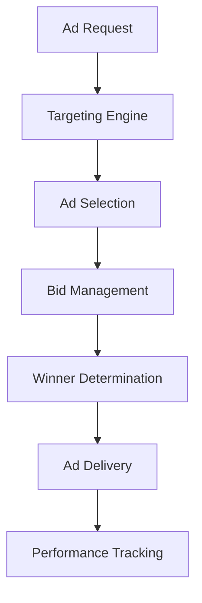

# Advertising

## Overview

The Advertising feature enables City Explorer to generate revenue through contextual placements while maintaining a positive user experience. This monetization strategy focuses on relevant, non-intrusive advertisements that complement the travel planning experience rather than disrupt it.

## Ad Placement Strategy

### Contextual Advertising
- **Location-Based Ads**: Promote local businesses in relevant city guides
- **Category-Relevant Ads**: Show restaurant ads on food-related content
- **Temporal Ads**: Seasonal promotions aligned with travel timing
- **User Interest Ads**: Targeted placements based on user preferences

### Non-Intrusive Formats
- **Native Advertising**: Seamlessly integrated with editorial content
- **Sponsored Content**: Clearly marked but naturally flowing content
- **Recommended Partners**: Contextually relevant service suggestions
- **Branded Experiences**: Immersive brand storytelling

## Ad Formats

### Banner Ads
- **Leaderboard**: 728x90 pixels at top of content
- **Medium Rectangle**: 300x250 pixels in sidebar
- **Wide Skyscraper**: 160x600 pixels for tall sidebars
- **Responsive Units**: Flexible sizing for mobile optimization

### Native Ads
- **In-Feed Units**: Blend with content listings
- **Recommendation Widgets**: "You Might Also Like" style placements
- **Promoted Listings**: Enhanced place cards with advertiser branding
- **Sponsored Articles**: Branded editorial content

### Video Ads
- **Pre-Roll**: Short ads before video content
- **Mid-Roll**: Break ads during longer videos
- **Post-Roll**: End-of-video promotional content
- **Overlay**: Non-blocking ads during video playback

### Interactive Ads
- **Rich Media**: Expandable and interactive units
- **Gamified Ads**: Playable branded experiences
- **Survey Ads**: Engaging question-based promotions
- **Calculator Widgets**: Interactive tools with branding

## Technical Implementation

### Ad Server Architecture


### Ad Serving System
```javascript
class AdServer {
  async selectAd(request) {
    // Extract targeting parameters
    const targeting = {
      location: request.cityId,
      category: request.contentCategory,
      device: request.deviceType,
      userSegment: await this.getUserSegment(request.userId),
      timeOfDay: this.getTimeOfDay(),
      dayOfWeek: this.getDayOfWeek()
    };
    
    // Query ad inventory
    const eligibleAds = await this.getEligibleAds(targeting);
    
    // Conduct auction
    const winningAd = await this.conductAuction(eligibleAds);
    
    // Track impression
    this.trackImpression(winningAd, request);
    
    return winningAd;
  }
  
  async getUserSegment(userId) {
    if (!userId) return 'anonymous';
    
    const user = await User.findById(userId);
    return user.isPremium ? 'premium' : 'free';
  }
}
```

### Ad Data Structure
```json
{
  "advertisement": {
    "_id": "ObjectId",
    "campaignId": "ObjectId",
    "advertiserId": "ObjectId",
    "name": "string",
    "type": "banner|native|video|interactive",
    "format": "728x90|300x250|native-feed|video-pre-roll",
    "creative": {
      "url": "string",
      "altText": "string",
      "clickUrl": "string",
      "trackingPixels": ["string"]
    },
    "targeting": {
      "locations": ["cityIds"],
      "categories": ["strings"],
      "userSegments": ["free|premium|business|leisure"],
      "devices": ["desktop|mobile|tablet"],
      "timeSlots": ["morning|afternoon|evening"],
      "daysOfWeek": ["monday|tuesday|..."]
    },
    "pricing": {
      "model": "cpm|cpc|cpa",
      "bidAmount": "number",
      "currency": "string"
    },
    "schedule": {
      "startDate": "ISO date",
      "endDate": "ISO date",
      "frequencyCap": "integer"
    },
    "status": "active|paused|completed",
    "performance": {
      "impressions": "integer",
      "clicks": "integer",
      "conversions": "integer",
      "spend": "number"
    },
    "createdAt": "ISO date",
    "updatedAt": "ISO date"
  }
}
```

## API Endpoints

### Get Ads for Placement
```
GET /api/v1/ads/placement/{placementId}?cityId={cityId}&categoryId={categoryId}
```

#### Response
```json
{
  "success": true,
  "ads": [
    {
      "_id": "ad_id",
      "type": "native",
      "creative": {
        "title": "Special Offer from Local Hotel",
        "description": "Luxury accommodation with exclusive City Explorer rates",
        "imageUrl": "https://example.com/ad-image.jpg",
        "clickUrl": "https://tracking.cityexplorer.com/click/ad_id",
        "ctaText": "View Deal"
      },
      "advertiser": {
        "name": "Grand Plaza Hotel",
        "logoUrl": "https://example.com/logo.jpg"
      }
    }
  ]
}
```

### Track Ad Impression
```
POST /api/v1/ads/track/impression
```

#### Request Body
```json
{
  "adId": "ad_id",
  "placementId": "placement_id",
  "userId": "user_id (optional)",
  "sessionId": "session_id"
}
```

#### Response
```json
{
  "success": true,
  "message": "Impression tracked successfully"
}
```

### Track Ad Click
```
POST /api/v1/ads/track/click
```

#### Request Body
```json
{
  "adId": "ad_id",
  "userId": "user_id (optional)",
  "sessionId": "session_id",
  "referrer": "page_url"
}
```

#### Response
```json
{
  "success": true,
  "redirectUrl": "destination_url"
}
```

### Get Ad Performance Report
```
GET /api/v1/ads/report?startDate={startDate}&endDate={endDate}&advertiserId={advertiserId}
```

#### Response
```json
{
  "success": true,
  "report": {
    "period": {
      "startDate": "2023-06-01T00:00:00.000Z",
      "endDate": "2023-06-30T23:59:59.999Z"
    },
    "summary": {
      "totalImpressions": 1250000,
      "totalClicks": 25000,
      "ctr": "2.00%",
      "totalSpend": 5000.00,
      "cpm": 4.00,
      "cpc": 0.20
    },
    "byAd": [
      {
        "adId": "ad_id",
        "adName": "Summer Sale Campaign",
        "impressions": 500000,
        "clicks": 12500,
        "ctr": "2.50%",
        "spend": 2500.00,
        "cpm": 5.00,
        "cpc": 0.20
      }
    ]
  }
}
```

## User Interface

### Ad Placement Areas
- **Header**: Leaderboard banner above main content
- **Sidebar**: Medium rectangle units in secondary content areas
- **Content Integration**: Native ads within article flows
- **Footer**: Additional banner placements
- **Interstitial**: Full-screen ads between major sections (limited frequency)

### Ad Design Guidelines
- **Visual Consistency**: Match site color scheme and typography
- **Clear Labeling**: Obvious "Advertisement" or "Sponsored" labels
- **Responsive Design**: Adapt to all screen sizes
- **Loading Optimization**: Fast-loading creative assets
- **Accessibility**: Alt text and keyboard navigation support

### User Controls
- **Ad Preferences**: Customize ad categories and frequency
- **Feedback Mechanism**: Report irrelevant or inappropriate ads
- **Opt-Out Options**: Reduce ad personalization
- **Premium Ad-Free**: Subscription option to remove ads

## Targeting Capabilities

### Geographic Targeting
- **City-Level**: Ads specific to individual cities
- **Regional**: Broader geographic areas
- **Country-Level**: National campaign targeting
- **Custom Areas**: User-defined geographic boundaries

### Demographic Targeting
- **Age Groups**: Target specific age ranges
- **Gender**: Gender-based ad selection
- **Income Levels**: Economic segmentation
- **Travel Behavior**: Based on booking history and preferences

### Behavioral Targeting
- **Content Interests**: Based on viewed content categories
- **Search History**: Related to user search queries
- **Booking Patterns**: Align with travel planning behavior
- **Engagement Levels**: Active vs passive users

### Contextual Targeting
- **Page Content**: Match ads to current page topics
- **Time of Day**: Morning, afternoon, evening targeting
- **Day of Week**: Weekend vs weekday campaigns
- **Seasonal Relevance**: Align with travel seasons

## Auction System

### Real-Time Bidding (RTB)
- **Programmatic Buying**: Automated ad purchasing
- **Second-Price Auctions**: Winner pays second-highest bid plus increment
- **Dynamic Pricing**: Real-time valuation based on targeting
- **Bid Optimization**: Automated bidding strategies

### Private Marketplace (PMP)
- **Invitation-Only Deals**: Exclusive ad inventory access
- **Preferred Deals**: Guaranteed inventory at fixed prices
- **Private Auctions**: Closed auctions for select advertisers
- **Programmatic Guaranteed**: Reserved inventory with programmatic buying

## Performance Measurement

### Key Metrics
- **Impressions**: Number of times ads are displayed
- **Clicks**: User interactions with ads
- **Click-Through Rate (CTR)**: Clicks divided by impressions
- **Conversion Rate**: Percentage of clicks resulting in desired actions
- **Cost Per Mille (CPM)**: Cost per 1,000 impressions
- **Cost Per Click (CPC)**: Cost per click
- **Cost Per Action (CPA)**: Cost per conversion
- **Viewability**: Percentage of ads viewed by users

### Attribution Models
- **Last Click**: Credit last ad interaction before conversion
- **First Click**: Credit first ad interaction in user journey
- **Linear**: Equal credit across all touchpoints
- **Time Decay**: More credit to recent interactions
- **Position-Based**: Heavy credit to first and last interactions

## Advertiser Management

### Onboarding Process
1. **Application**: Advertiser submits campaign details
2. **Review**: Content and targeting approval
3. **Setup**: Creative asset upload and configuration
4. **Testing**: Quality assurance and preview
5. **Launch**: Campaign goes live

### Campaign Management
- **Budget Controls**: Daily and total spend limits
- **Schedule Management**: Start/stop dates and time restrictions
- **Creative Rotation**: Multiple ad variations
- **Performance Optimization**: Automated bid adjustments

### Reporting Dashboard
- **Real-Time Metrics**: Current campaign performance
- **Historical Analysis**: Trend data and comparisons
- **Audience Insights**: Demographics and behavior data
- **Competitive Analysis**: Benchmark performance data

## Privacy and Compliance

### Data Protection
- **GDPR Compliance**: European privacy regulation adherence
- **CCPA Compliance**: California consumer privacy requirements
- **Data Minimization**: Only collect necessary information
- **User Consent**: Clear opt-in for personalized advertising

### Transparency Requirements
- **Ad Disclosure**: Clear labeling of sponsored content
- **Privacy Policy**: Detailed data usage explanation
- **Opt-Out Mechanisms**: Easy user preference management
- **Third-Party Audits**: Regular compliance verification

## Quality Assurance

### Ad Standards
- **Content Guidelines**: Prohibited categories and content types
- **Technical Requirements**: File size and format specifications
- **Brand Safety**: Protection from harmful associations
- **User Experience**: Non-disruptive ad implementation

### Moderation Process
- **Automated Screening**: Initial content and policy checks
- **Manual Review**: Human verification for complex cases
- **Ongoing Monitoring**: Continuous quality assessment
- **Violation Handling**: Enforcement of policy violations

## Integration with Other Features

### AI-Powered Itineraries
- **Sponsored Recommendations**: Relevant paid placements in itineraries
- **Branded Experiences**: Integrated advertiser content
- **Affiliate Synergy**: Combined advertising and affiliate strategies
- **Dynamic Insertion**: Real-time ad optimization

### Community Features
- **User-Generated Content**: Sponsored social sharing
- **Influencer Partnerships**: Branded community campaigns
- **Contests and Giveaways**: Promotional event sponsorship
- **Review Integration**: Sponsored product mentions

### Gamification
- **Rewarded Ads**: Optional ad viewing for premium features
- **Sponsored Challenges**: Brand-funded trivia and games
- **Achievement Badges**: Co-branded recognition programs
- **Leaderboard Sponsorship**: Branded competition rankings

## Security Considerations

### Ad Security
- **Malware Protection**: Scan creative assets for malicious code
- **Fraud Prevention**: Detect and block invalid traffic
- **Brand Safety**: Prevent harmful content associations
- **Data Security**: Protect user information in ad systems

### Infrastructure Security
- **DDoS Protection**: Guard against traffic flooding attacks
- **Access Controls**: Restrict system administration access
- **Encryption**: Secure data transmission and storage
- **Audit Trails**: Comprehensive activity logging

## Monitoring and Analytics

### Real-Time Monitoring
- **System Health**: Ad server performance metrics
- **Traffic Patterns**: Volume and distribution analysis
- **Error Tracking**: Technical issue identification
- **Anomaly Detection**: Unusual activity alerts

### Performance Analytics
- **Revenue Tracking**: Ad income attribution
- **User Impact**: Effect on platform engagement
- **Campaign Effectiveness**: ROI measurement for advertisers
- **Optimization Insights**: Data-driven improvement opportunities

## Troubleshooting

### Common Issues

1. **Low Ad Fill Rates**
   - Solution: Expand advertiser network
   - Solution: Adjust targeting criteria
   - Solution: Optimize pricing strategies

2. **Poor Performance Metrics**
   - Solution: Review creative quality
   - Solution: Refine targeting parameters
   - Solution: Test different ad formats

3. **Technical Delivery Problems**
   - Solution: Check ad server configuration
   - Solution: Validate tracking implementation
   - Solution: Review content security policies

## Future Enhancements

### Advanced Technologies
- **AI-Powered Targeting**: Machine learning optimization
- **Dynamic Creative**: Real-time ad personalization
- **Voice Advertising**: Audio-based promotional content
- **AR Integration**: Augmented reality advertising experiences

### New Formats
- **Interactive Video**: Engaging playable ad content
- **Social Commerce**: Shopping-enabled ad units
- **Live Streaming**: Real-time promotional broadcasts
- **Immersive Experiences**: VR/AR advertising formats

## Best Practices

### For Advertisers
- Create relevant, valuable content for target audiences
- Ensure fast-loading, mobile-optimized creative assets
- Follow platform guidelines for content and targeting
- Monitor performance and optimize campaigns regularly

### For Publishers
- Maintain high-quality, relevant ad inventory
- Implement clear labeling of sponsored content
- Protect user privacy and data security
- Provide excellent advertiser support and reporting

### For Developers
- Design scalable, reliable ad serving infrastructure
- Implement comprehensive tracking and analytics
- Ensure compliance with privacy regulations
- Optimize for performance and user experience