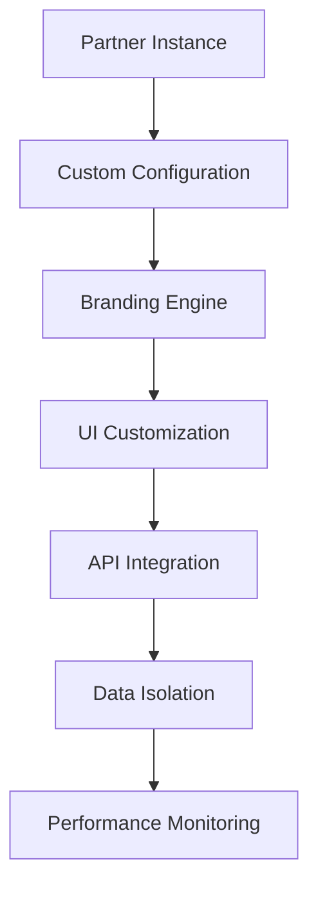

# B2B Licensing

## Overview

The B2B Licensing feature enables City Explorer to offer white-label solutions and API access to tourism organizations, travel agencies, and other businesses. This enterprise monetization strategy expands market reach while providing customized travel planning capabilities to partners who can leverage our technology platform.

## Licensing Models

### White-Label Solutions
- **Full White-Label**: Complete rebranding with partner's identity
- **Co-Branding**: Joint branding with City Explorer and partner
- **Private Label**: Dedicated instance with custom features
- **Reseller Model**: Partner sells under their brand with our support

### API Access
- **Basic API**: Limited access to core data and functionality
- **Premium API**: Extended features and higher rate limits
- **Enterprise API**: Custom integrations and dedicated support
- **Partner API**: Specialized endpoints for travel partners

### Subscription Tiers
- **Starter**: Small businesses and startups
- **Professional**: Growing companies with moderate needs
- **Enterprise**: Large organizations with complex requirements
- **Custom**: Tailored solutions for unique use cases

## Technical Implementation

### White-Label Architecture


### Multi-Tenancy System
```javascript
class TenantManager {
  async initializeTenant(tenantConfig) {
    // Create isolated tenant environment
    const tenant = await this.createTenantDatabase(tenantConfig);
    
    // Apply custom branding
    await this.applyBranding(tenant.id, tenantConfig.branding);
    
    // Configure API access
    await this.setupAPIKeys(tenant.id, tenantConfig.apiPermissions);
    
    // Set up data isolation
    await this.configureDataIsolation(tenant.id);
    
    return tenant;
  }
  
  async applyBranding(tenantId, brandingConfig) {
    const branding = {
      logo: brandingConfig.logoUrl,
      colors: {
        primary: brandingConfig.primaryColor,
        secondary: brandingConfig.secondaryColor,
        accent: brandingConfig.accentColor
      },
      fonts: brandingConfig.fonts,
      favicon: brandingConfig.faviconUrl,
      customCSS: brandingConfig.customStyles
    };
    
    await this.saveTenantBranding(tenantId, branding);
  }
}
```

### Licensing Data Structure
```json
{
  "license": {
    "_id": "ObjectId",
    "tenantId": "ObjectId",
    "partnerName": "string",
    "contactInfo": {
      "name": "string",
      "email": "string",
      "phone": "string",
      "address": "string"
    },
    "licenseType": "white-label|api-access|custom",
    "tier": "starter|professional|enterprise|custom",
    "features": ["feature1", "feature2"],
    "customizations": {
      "branding": "boolean",
      "apiAccess": "boolean",
      "dataExport": "boolean",
      "supportLevel": "standard|premium|vip"
    },
    "usageLimits": {
      "apiCallsPerDay": "integer",
      "users": "integer",
      "storage": "integer (MB)",
      "bandwidth": "integer (GB)"
    },
    "billing": {
      "model": "subscription|pay-per-use|custom",
      "amount": "number",
      "currency": "string",
      "cycle": "monthly|annual|custom",
      "nextBillingDate": "ISO date"
    },
    "contract": {
      "startDate": "ISO date",
      "endDate": "ISO date",
      "renewalTerms": "string",
      "terminationClause": "string"
    },
    "status": "active|suspended|expired|terminated",
    "createdAt": "ISO date",
    "updatedAt": "ISO date"
  }
}
```

## API Endpoints

### Create Tenant
```
POST /api/v1/b2b/tenants
```

#### Request Body
```json
{
  "partnerName": "Travel Agency Inc.",
  "contactInfo": {
    "name": "John Smith",
    "email": "john@travelagency.com",
    "phone": "+1-555-123-4567",
    "address": "123 Business St, City, State 12345"
  },
  "licenseType": "white-label",
  "tier": "professional",
  "branding": {
    "primaryColor": "#0066cc",
    "secondaryColor": "#ff6600",
    "logoUrl": "https://travelagency.com/logo.png"
  }
}
```

#### Response
```json
{
  "success": true,
  "tenant": {
    "_id": "tenant_id",
    "tenantId": "ta-12345",
    "partnerName": "Travel Agency Inc.",
    "apiKey": "sk_ta_1234567890abcdef",
    "apiSecret": "ss_ta_0987654321fedcba",
    "dashboardUrl": "https://ta-12345.cityexplorer.com",
    "status": "provisioning"
  }
}
```

### Get Tenant Information
```
GET /api/v1/b2b/tenants/{tenantId}
```

#### Response
```json
{
  "success": true,
  "tenant": {
    "_id": "tenant_id",
    "tenantId": "ta-12345",
    "partnerName": "Travel Agency Inc.",
    "licenseType": "white-label",
    "tier": "professional",
    "features": ["itineraries", "maps", "reviews"],
    "usage": {
      "apiCallsToday": 1250,
      "users": 42,
      "storageUsed": "125MB",
      "bandwidthUsed": "2.4GB"
    },
    "limits": {
      "apiCallsPerDay": 5000,
      "users": 100,
      "storage": "500MB",
      "bandwidth": "10GB"
    },
    "billing": {
      "nextBillingDate": "2023-07-15T00:00:00.000Z",
      "amount": 299.00,
      "currency": "USD",
      "status": "active"
    },
    "status": "active"
  }
}
```

### Update Tenant Configuration
```
PUT /api/v1/b2b/tenants/{tenantId}
```

#### Request Body
```json
{
  "branding": {
    "primaryColor": "#0077cc",
    "faviconUrl": "https://travelagency.com/favicon.ico"
  },
  "usageLimits": {
    "users": 150
  }
}
```

#### Response
```json
{
  "success": true,
  "message": "Tenant configuration updated successfully"
}
```

### Get API Usage Report
```
GET /api/v1/b2b/tenants/{tenantId}/usage?period={startDate},{endDate}
```

#### Response
```json
{
  "success": true,
  "usageReport": {
    "period": {
      "startDate": "2023-06-01T00:00:00.000Z",
      "endDate": "2023-06-30T23:59:59.999Z"
    },
    "summary": {
      "totalApiCalls": 125430,
      "peakConcurrency": 45,
      "averageResponseTime": 125,
      "errorRate": "0.23%"
    },
    "dailyBreakdown": [
      {
        "date": "2023-06-01T00:00:00.000Z",
        "apiCalls": 4200,
        "users": 38,
        "storageUsed": "120MB",
        "bandwidthUsed": "2.1GB"
      }
    ]
  }
}
```

## Partner Portal

### Dashboard Features
- **Usage Analytics**: Real-time API consumption metrics
- **Billing Management**: Payment history and upcoming charges
- **Configuration Tools**: Branding and feature customization
- **Support Center**: Ticketing system and documentation
- **API Documentation**: Interactive API explorer and testing tools

### Self-Service Tools
- **Branding Studio**: Visual editor for custom themes
- **Feature Toggles**: Enable/disable platform capabilities
- **User Management**: Administer partner organization users
- **Data Export**: Download usage and performance reports
- **Integration Testing**: Sandbox environment for API development

### Administrative Functions
- **License Management**: Upgrade/downgrade subscription tiers
- **Contract Renewals**: Manage agreement extensions
- **Custom Development**: Request specialized features
- **Training Resources**: Educational materials and webinars
- **Partner Directory**: Network with other licensees

## Technical Customization

### Branding Options
- **Visual Identity**: Logo, colors, fonts, and styling
- **Domain Management**: Custom subdomains or CNAME support
- **Email Templates**: Branded communication assets
- **Documentation Branding**: Custom help content and guides
- **Localization**: Multi-language interface support

### Feature Customization
- **Module Selection**: Choose which platform features to include
- **Workflow Adaptation**: Modify business processes and logic
- **Data Fields**: Add custom attributes and metadata
- **Integration Points**: Connect with partner systems
- **Reporting Customization**: Tailored analytics and dashboards

### API Customization
- **Endpoint Whitelisting**: Restrict access to specific functions
- **Rate Limiting**: Custom request volume controls
- **Data Filtering**: Limit returned data fields and records
- **Authentication Methods**: Support for partner identity systems
- **Response Formatting**: Custom data structure transformations

## Data Isolation and Security

### Multi-Tenant Architecture
- **Database Separation**: Isolated data storage per tenant
- **API Isolation**: Segregated access controls and permissions
- **Resource Allocation**: Dedicated compute and storage resources
- **Network Segmentation**: Secure tenant-to-tenant separation
- **Backup Isolation**: Independent data protection per tenant

### Compliance Framework
- **GDPR Compliance**: European data protection regulation
- **SOC 2 Certification**: Security and availability standards
- **PCI DSS**: Payment card industry data security
- **HIPAA**: Healthcare information privacy (if applicable)
- **Industry-Specific**: Tourism and travel sector regulations

### Security Measures
- **Encryption**: Data-at-rest and data-in-transit protection
- **Access Controls**: Role-based permissions and authentication
- **Audit Logging**: Comprehensive activity tracking
- **Vulnerability Management**: Regular security assessments
- **Incident Response**: Established breach handling procedures

## Performance and Scalability

### Resource Management
- **Auto-Scaling**: Dynamic resource allocation based on demand
- **Load Balancing**: Distribution of traffic across instances
- **Caching Strategy**: Optimized data retrieval for performance
- **Database Optimization**: Efficient querying and indexing
- **Content Delivery**: CDN integration for global performance

### Monitoring and Maintenance
- **Health Checks**: Continuous system status monitoring
- **Performance Metrics**: Real-time response time and throughput
- **Capacity Planning**: Proactive resource provisioning
- **Maintenance Windows**: Scheduled updates with minimal disruption
- **Disaster Recovery**: Backup and restore capabilities

## Partner Onboarding

### Implementation Process
1. **Needs Assessment**: Understand partner requirements and goals
2. **Solution Design**: Create customized licensing proposal
3. **Contract Negotiation**: Agree on terms and pricing
4. **Technical Setup**: Provision tenant environment
5. **Integration Testing**: Validate functionality and performance
6. **Training**: Educate partner team on platform usage
7. **Go-Live**: Official launch of partner instance
8. **Ongoing Support**: Continuous assistance and optimization

### Training Programs
- **Administrator Training**: Platform configuration and management
- **Developer Training**: API integration and customization
- **End-User Training**: Daily operations and feature usage
- **Business Training**: Maximizing platform value and ROI
- **Certification Programs**: Formal competency validation

## Billing and Pricing

### Pricing Models
- **Subscription-Based**: Monthly or annual recurring fees
- **Usage-Based**: Pay-per-API-call or per-active-user pricing
- **Hybrid Model**: Combination of subscription and usage fees
- **Enterprise Licensing**: Custom contracts with negotiated terms
- **Revenue Sharing**: Commission-based arrangements for certain partners

### Billing Features
- **Automated Invoicing**: Regular billing statement generation
- **Payment Processing**: Support for multiple payment methods
- **Usage Tracking**: Detailed consumption reporting
- **Budget Management**: Spending limits and alerts
- **Tax Compliance**: Automatic tax calculation and reporting

## Support and SLA

### Support Tiers
- **Standard**: Business-hour support with 24-hour response
- **Premium**: Extended hours with 4-hour response for critical issues
- **VIP**: 24/7 support with 1-hour response for critical issues
- **Dedicated Account Manager**: Personalized relationship management

### Service Level Agreements
- **Uptime Guarantee**: 99.9% platform availability commitment
- **Performance Metrics**: Response time and throughput guarantees
- **Support Response Times**: Defined SLAs for issue resolution
- **Maintenance Windows**: Scheduled downtime with advance notice
- **Compensation**: Service credits for SLA breaches

## Integration Capabilities

### API Integration
- **RESTful Endpoints**: Standard HTTP-based interface
- **GraphQL Support**: Flexible query language for data retrieval
- **Webhook System**: Real-time event notifications
- **SDK Libraries**: Language-specific integration tools
- **Documentation**: Comprehensive API reference and examples

### Third-Party Connectors
- **CRM Integration**: Salesforce, HubSpot, and other CRM platforms
- **Marketing Tools**: Mailchimp, Marketo, and email marketing systems
- **Analytics Platforms**: Google Analytics, Adobe Analytics integration
- **Payment Gateways**: Stripe, PayPal, and other payment processors
- **Booking Systems**: Integration with reservation and booking platforms

## Partnership Benefits

### Revenue Opportunities
- **White-Label Reselling**: Profit from re-selling our platform
- **Referral Commissions**: Earn from bringing new partners
- **Custom Development**: Revenue from specialized feature creation
- **Consulting Services**: Advisory services for implementation
- **Training Programs**: Educational services for partner teams

### Competitive Advantages
- **Time-to-Market**: Rapid deployment of travel planning capabilities
- **Technology Access**: Cutting-edge AI and mapping features
- **Scalability**: Enterprise-grade infrastructure and performance
- **Support**: Professional services and technical assistance
- **Updates**: Continuous feature enhancements and security patches

## Monitoring and Analytics

### Partner Performance
- **Usage Analytics**: Track adoption and engagement metrics
- **Revenue Tracking**: Monitor licensing and commission income
- **Churn Analysis**: Identify at-risk partnerships
- **Growth Metrics**: Measure expansion and upsell success
- **Satisfaction Scores**: Partner feedback and NPS tracking

### Platform Health
- **System Performance**: Monitor uptime and response times
- **Resource Utilization**: Track compute and storage consumption
- **Security Monitoring**: Detect and respond to threats
- **Compliance Auditing**: Verify regulatory adherence
- **Capacity Planning**: Forecast resource needs

## Troubleshooting

### Common Issues

1. **Provisioning Delays**
   - Solution: Check system capacity and queue status
   - Solution: Verify configuration parameters
   - Solution: Review automated setup workflows

2. **Performance Degradation**
   - Solution: Analyze resource utilization metrics
   - Solution: Review API usage patterns
   - Solution: Optimize database queries and caching

3. **Integration Problems**
   - Solution: Validate API credentials and permissions
   - Solution: Check network connectivity and firewall rules
   - Solution: Review data format and validation requirements

## Future Enhancements

### Advanced Features
- **AI Customization**: Partner-specific machine learning models
- **Blockchain Integration**: Decentralized identity and contract management
- **IoT Connectivity**: Integration with smart travel devices
- **Voice Interfaces**: Audio-based platform interaction
- **Augmented Reality**: AR-enhanced travel planning experiences

### Marketplace Expansion
- **Partner Ecosystem**: Directory of complementary service providers
- **Plugin Architecture**: Third-party extension marketplace
- **Co-Innovation Programs**: Joint development initiatives
- **Franchise Model**: Regional licensing opportunities
- **Channel Partnerships**: Reseller and distributor networks

## Best Practices

### For Partners
- Clearly define business objectives before implementation
- Invest in proper training for technical and business teams
- Establish governance processes for platform usage
- Monitor performance metrics and user feedback regularly
- Maintain open communication with support team

### For City Explorer Team
- Provide comprehensive onboarding and training programs
- Maintain clear documentation and API specifications
- Implement robust monitoring and alerting systems
- Establish standardized processes for partner interactions
- Continuously gather and act on partner feedback