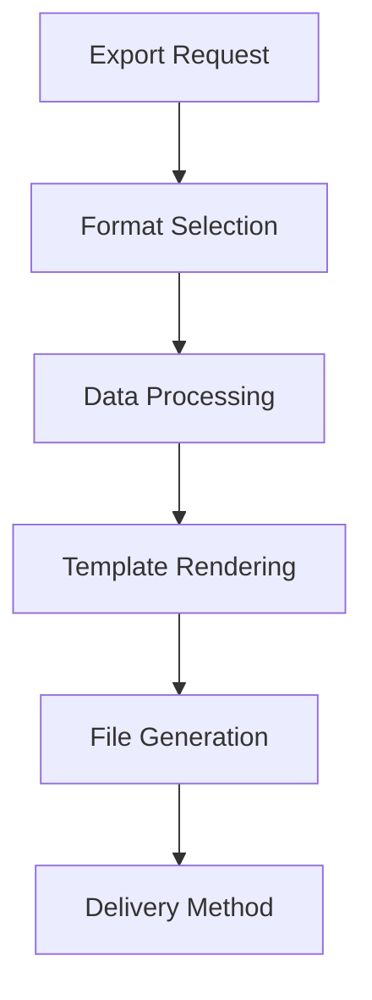

# Advanced Export Options

## Overview

The Advanced Export Options feature provides premium users with sophisticated capabilities to export their travel itineraries and plans in multiple formats. This functionality enables seamless integration with other travel tools, sharing with companions, and offline access to travel information.

## Supported Export Formats

### 1. PDF Documents
- Professionally formatted travel itineraries
- Printable guides with maps and directions
- Customizable templates and branding
- Password protection for sensitive information

### 2. JSON Data
- Machine-readable itinerary data
- Full API compatibility
- Integration with third-party travel applications
- Backup and migration capabilities

### 3. Calendar Integration
- iCalendar (.ics) format for calendar apps
- Automatic event creation with reminders
- Time zone handling for international travel
- Recurring event support for regular trips

### 4. Spreadsheet Formats
- CSV and Excel-compatible exports
- Structured data for analysis
- Custom column arrangements
- Formula-ready formatting

## Technical Implementation

### Export Engine Architecture


### Data Transformation Pipeline
1. **Input Validation**: Verify export parameters and permissions
2. **Data Retrieval**: Fetch relevant itinerary and place data
3. **Format Conversion**: Transform data to target format specifications
4. **Template Application**: Apply formatting and styling
5. **File Packaging**: Create downloadable file
6. **Delivery**: Provide file via download link or email

### Format-Specific Handlers
```javascript
class ExportHandler {
  async generatePDF(itineraryId, options) {
    // PDF generation logic
    const itinerary = await getItinerary(itineraryId);
    const template = await loadPDFTemplate(options.template);
    return pdfGenerator.render(template, itinerary, options);
  }
  
  async generateJSON(itineraryId, options) {
    // JSON serialization logic
    const itinerary = await getItinerary(itineraryId);
    return jsonSerializer.serialize(itinerary, options);
  }
  
  async generateICS(itineraryId, options) {
    // iCalendar generation logic
    const itinerary = await getItinerary(itineraryId);
    return icsGenerator.create(itinerary, options);
  }
  
  async generateCSV(itineraryId, options) {
    // CSV generation logic
    const itinerary = await getItinerary(itineraryId);
    return csvGenerator.format(itinerary, options);
  }
}
```

## API Endpoints

### Initiate Export
```
POST /api/v1/export/initiate
```

#### Request Body
```json
{
  "itineraryId": "string",
  "format": "pdf|json|ics|csv|xlsx",
  "options": {
    "template": "string (PDF only)",
    "includeMaps": "boolean (PDF only)",
    "timezone": "string (ICS only)",
    "columns": ["string"] (CSV/XLSX only),
    "deliveryMethod": "download|email"
  }
}
```

#### Response
```json
{
  "success": true,
  "exportId": "string",
  "status": "processing",
  "estimatedCompletion": "ISO timestamp"
}
```

### Check Export Status
```
GET /api/v1/export/status/{exportId}
```

#### Response
```json
{
  "success": true,
  "exportId": "string",
  "status": "completed|processing|failed",
  "downloadUrl": "string (when completed)",
  "error": "string (when failed)"
}
```

### Download Export
```
GET /api/v1/export/download/{exportId}
```

#### Response
- Binary file content with appropriate Content-Type header
- Or redirect to signed URL for large files

## User Interface

### Export Wizard
1. **Format Selection**: Visual chooser for export formats
2. **Options Configuration**: Format-specific customization
3. **Preview**: Sample of exported content
4. **Processing**: Progress indicator during generation
5. **Delivery**: Download or email options

### Format-Specific Options

#### PDF Options
- Template selection (minimal, detailed, photo-heavy)
- Page size and orientation
- Map inclusion toggle
- Cover page customization
- Password protection

#### JSON Options
- Data filtering (select specific fields)
- Formatting (pretty-printed vs compact)
- Schema version selection
- Include/exclude nested data

#### ICS Options
- Time zone conversion
- Reminder settings
- Recurrence rules
- Calendar name specification

#### CSV/XLSX Options
- Column selection and ordering
- Data formatting (dates, currencies)
- Header row customization
- Separator character selection (CSV only)

## PDF Export Features

### Template System
- **Minimal**: Clean, text-focused layout
- **Detailed**: Comprehensive information with photos
- **Photo-Heavy**: Visual emphasis with large images
- **Custom**: User-created templates

### Content Elements
- Itinerary title and description
- Day-by-day breakdown with timelines
- Place details with addresses and contact info
- Embedded maps and directions
- Weather forecasts
- Emergency contact information
- Custom notes and reminders

### Styling Options
- Color scheme customization
- Font selection and sizing
- Logo and branding placement
- Page numbering and headers/footers
- Table of contents generation

## Calendar Integration

### Event Creation
- Individual events for each itinerary item
- Duration-based appointments
- Location data for navigation
- Attached notes and descriptions

### Reminder System
- Default reminder settings
- Custom reminder times
- Push notification support
- Email reminder options

### Time Zone Handling
- Automatic conversion based on destination
- Manual override capabilities
- DST consideration
- Multi-timezone support for complex itineraries

## Spreadsheet Exports

### Data Structure
- **Header Row**: Column labels
- **Itinerary Metadata**: Title, dates, creator
- **Daily Breakdown**: One row per day or activity
- **Place Details**: Separate sheets for detailed place info

### Column Options
- Activity name and description
- Date and time information
- Location coordinates
- Duration and travel time
- Cost estimates
- Category and tags
- Custom user fields

### Formatting Features
- Currency formatting
- Date/time formatting
- Conditional formatting rules
- Data validation dropdowns
- Hyperlinks to place pages

## Performance Considerations

### Processing Optimization
- Asynchronous generation with job queues
- Parallel processing for large exports
- Caching of commonly requested exports
- Resource limits to prevent system overload

### File Delivery
- CDN distribution for large files
- Streaming delivery for immediate access
- Compression for reduced bandwidth
- Signed URLs for secure delivery

## Security Considerations

### Data Protection
- Encryption for sensitive export data
- Access controls for premium features
- Audit logging of export activities
- Expiration of download links

### Privacy Compliance
- GDPR-compliant data handling
- User consent for data export
- Right to erasure for exported data
- Transparent data processing

## Monitoring and Analytics

### Export Metrics
- **Usage Statistics**: Format popularity and frequency
- **Performance Data**: Generation times and success rates
- **User Behavior**: Common export patterns and preferences
- **Error Tracking**: Failure reasons and troubleshooting

### Resource Monitoring
- **System Load**: Impact of export processing on servers
- **Storage Usage**: Temporary and cached file storage
- **Bandwidth Consumption**: File delivery metrics
- **Queue Health**: Job processing efficiency

## Troubleshooting

### Common Issues

1. **Export Generation Failures**
   - Solution: Check input data validity
   - Solution: Review format-specific constraints
   - Solution: Verify system resources

2. **Download Problems**
   - Solution: Check file size limits
   - Solution: Verify delivery method configuration
   - Solution: Review network connectivity

3. **Formatting Issues**
   - Solution: Validate template compatibility
   - Solution: Check data mapping accuracy
   - Solution: Review export options

4. **Performance Degradation**
   - Solution: Optimize data retrieval queries
   - Solution: Implement better caching
   - Solution: Scale export processing workers

## Future Enhancements

### New Export Formats
- **EPUB**: eBook format for reading on e-readers
- **KML/KMZ**: Google Earth integration
- **GPX**: GPS device compatibility
- **Markdown**: Plain text documentation format

### Advanced Features
- **Batch Export**: Multiple itineraries at once
- **Scheduled Export**: Automatic generation and delivery
- **Collaborative Editing**: Shared export templates
- **Version History**: Track export revisions

### Integration Opportunities
- **Travel Apps**: Direct export to TripIt, Google Trips
- **Booking Systems**: Integration with reservation platforms
- **Navigation Apps**: Send to Google Maps, Waze
- **Social Media**: Direct sharing to travel communities

## Best Practices

### For Developers
- Implement comprehensive error handling and logging
- Design scalable architecture for high-volume exports
- Optimize for various file sizes and complexities
- Ensure cross-platform compatibility
- Maintain backward compatibility with export formats

### For Users
- Choose appropriate export formats for intended use
- Customize options to meet specific needs
- Save frequently used export configurations
- Check exported files before sharing
- Keep exported files organized for future reference