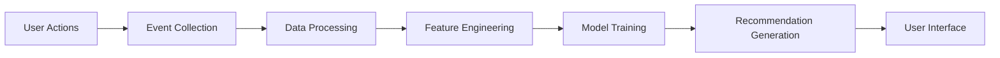

# Personalized Recommendations

## Overview

The Personalized Recommendations feature uses machine learning algorithms and user behavior analysis to suggest relevant places, itineraries, and content tailored to individual preferences. This system enhances user engagement by delivering precisely targeted content that aligns with each traveler's interests, history, and behavior patterns.

## Recommendation Types

### 1. Place Recommendations
- Suggests attractions, restaurants, and hotels based on user preferences
- Considers past visits, saved favorites, and review history
- Factors in seasonal trends and popularity

### 2. Itinerary Recommendations
- Curates pre-made itineraries matching user interests
- Recommends based on trip duration and travel style
- Highlights trending and seasonal itineraries

### 3. City Recommendations
- Suggests cities to visit based on user profile
- Considers travel history and wishlist
- Factors in budget and preferred climates

### 4. Event Recommendations
- Promotes local events, festivals, and activities
- Matches user interests and location
- Provides timely notifications for upcoming events

## Algorithm Framework

### Collaborative Filtering
- User-based similarity: Find users with similar preferences
- Item-based similarity: Recommend places liked by similar users
- Matrix factorization for scalable computation

### Content-Based Filtering
- Analyze place attributes and categories
- Match with user preference profile
- Weight features based on user interactions

### Hybrid Approach
- Combine collaborative and content-based methods
- Dynamically adjust weights based on performance
- Handle cold start problem for new users/places

### Deep Learning Models
- Neural networks for complex pattern recognition
- Recurrent networks for sequential behavior analysis
- Embedding techniques for categorical data

## Data Sources

### Explicit Feedback
- User ratings and reviews
- Favorite places and saved itineraries
- Preference surveys and quizzes
- Wishlist and travel goals

### Implicit Feedback
- View duration and interaction patterns
- Search queries and filters
- Click-through rates on recommendations
- Time spent on place pages

### Contextual Data
- Current location and season
- Device type and browsing context
- Time of day and day of week
- Weather and local events

### Demographic Information
- Age group and travel party composition
- Geographic origin and travel history
- Language preferences
- Cultural interests

## Technical Implementation

### Data Pipeline


### Feature Engineering
- **User Features**: Preferences, demographics, behavior history
- **Item Features**: Place attributes, categories, popularity metrics
- **Context Features**: Time, location, device, weather
- **Interaction Features**: Ratings, views, saves, shares

### Model Architecture
```json
{
  "recommendationModel": {
    "type": "hybrid",
    "components": [
      {
        "name": "collaborativeFilter",
        "algorithm": "matrixFactorization",
        "weight": 0.4
      },
      {
        "name": "contentFilter",
        "algorithm": "neuralNetwork",
        "weight": 0.35
      },
      {
        "name": "trendingFilter",
        "algorithm": "popularityBased",
        "weight": 0.15
      },
      {
        "name": "contextualFilter",
        "algorithm": "decisionTree",
        "weight": 0.1
      }
    ],
    "trainingSchedule": "daily",
    "evaluationMetrics": ["precision", "recall", "ndcg"]
  }
}
```

## API Endpoints

### Get Personalized Places
```
GET /api/v1/recommendations/places?limit={limit}&category={category}
```

#### Response
```json
{
  "success": true,
  "recommendations": [
    {
      "_id": "place_id",
      "name": "Recommended Place",
      "type": "attraction|restaurant|hotel",
      "cityId": "city_id",
      "coordinates": {
        "lat": 12.3456,
        "lng": 78.9012
      },
      "rating": {
        "average": 4.5,
        "count": 123
      },
      "priceRange": "$$",
      "images": ["string"],
      "reason": "Based on your interest in similar historical sites"
    }
  ]
}
```

### Get Personalized Itineraries
```
GET /api/v1/recommendations/itineraries?limit={limit}&duration={days}
```

#### Response
```json
{
  "success": true,
  "recommendations": [
    {
      "_id": "itinerary_id",
      "title": "Historical City Tour",
      "cityId": "city_id",
      "cityName": "City Name",
      "days": 3,
      "rating": {
        "average": 4.7,
        "count": 89
      },
      "images": ["string"],
      "reason": "Matches your interest in historical attractions"
    }
  ]
}
```

### Get Personalized Cities
```
GET /api/v1/recommendations/cities?limit={limit}&budget={budget}
```

#### Response
```json
{
  "success": true,
  "recommendations": [
    {
      "_id": "city_id",
      "name": "Recommended City",
      "country": "Country Name",
      "coordinates": {
        "lat": 12.3456,
        "lng": 78.9012
      },
      "description": "Brief city description",
      "imageUrl": "string",
      "reason": "Popular destination for travelers with similar interests"
    }
  ]
}
```

### Explain Recommendation
```
GET /api/v1/recommendations/explain?itemId={itemId}&itemType={place|itinerary|city}
```

#### Response
```json
{
  "success": true,
  "explanation": {
    "itemId": "item_id",
    "itemType": "place",
    "reasons": [
      "Similar to places you've rated highly",
      "Matches your expressed interest in history",
      "Popular among travelers with similar profiles",
      "Currently trending in your area"
    ],
    "factors": {
      "userPreferenceMatch": 0.85,
      "popularity": 0.72,
      "seasonalRelevance": 0.65,
      "geographicProximity": 0.91
    }
  }
}
```

## User Interface

### Recommendation Widgets
- **For You Carousel**: Horizontally scrollable place recommendations
- **Discovery Feed**: Mixed content recommendations in feed format
- **Trip Inspiration**: City and itinerary recommendations
- **Local Picks**: Event and activity suggestions

### Personalization Controls
- Preference adjustment sliders
- Interest category selection
- Feedback mechanisms (thumbs up/down)
- Reason transparency toggles

### Explanation Interface
- "Why am I seeing this?" tooltips
- Detailed factor breakdown
- Comparison with similar users
- Option to provide feedback on relevance

## Real-Time Updates

### Behavior Tracking
- Immediate recording of user interactions
- Streaming processing for instant updates
- Session-based contextual adjustments
- A/B testing for recommendation strategies

### Model Refresh
- Incremental learning for rapid adaptation
- Batch retraining for comprehensive updates
- Performance monitoring and automatic rollback
- Canary deployment for new model versions

## Cold Start Solutions

### New User Handling
- Signup survey for initial preferences
- Popular item recommendations
- Demographic-based defaults
- Social proof and trending content

### New Item Handling
- Content-based similarity matching
- Expert curation for featured items
- Early adopter targeting
- Promotion to specific user segments

## Evaluation Metrics

### Offline Metrics
- **Precision@K**: Proportion of recommended items user interacts with
- **Recall@K**: Proportion of relevant items that are recommended
- **NDCG**: Normalized discounted cumulative gain
- **Coverage**: Proportion of items that can be recommended

### Online Metrics
- **Click-through Rate**: Percentage of recommendations clicked
- **Conversion Rate**: Percentage of clicks leading to bookings
- **Engagement Time**: Duration of interaction with recommended content
- **User Satisfaction**: Survey-based feedback scores

### Business Metrics
- **Revenue Impact**: Contribution to affiliate commissions
- **User Retention**: Effect on continued platform usage
- **Diversity**: Breadth of recommended item categories
- **Serendipity**: Discovery of unexpected but relevant items

## Integration with Other Features

### AI-Powered Itineraries
- Recommendations inform itinerary personalization
- Itinerary performance feeds back to recommendation models
- Cross-feature reinforcement learning

### Gamification
- Points for engaging with recommendations
- Badges for discovering new categories
- Challenges based on recommendation exploration

### Community Features
- Social proof in recommendation scoring
- Friend activity influences suggestions
- Community-curated recommendation lists

## Performance Optimization

### Caching Strategy
- Pre-compute recommendations for popular segments
- Cache user-specific recommendations with short TTL
- Store model predictions for quick retrieval

### Scalability
- Distributed computing for model training
- Edge caching for recommendation delivery
- Load shedding during peak traffic

### Latency Reduction
- Asynchronous recommendation generation
- Progressive loading of recommendation sets
- Predictive prefetching based on user behavior

## Security Considerations

### Data Privacy
- Anonymize user data in model training
- Implement differential privacy techniques
- Comply with GDPR and other privacy regulations
- Provide user control over data usage

### Bias Mitigation
- Regular audit for demographic bias
- Fairness constraints in model training
- Diversity promotion in recommendations
- Transparent explanation of decision factors

## Monitoring and Analytics

### Model Performance
- Daily evaluation of prediction accuracy
- A/B testing of algorithm variants
- Drift detection for data distribution changes
- Alerting for significant performance drops

### User Feedback
- Continuous collection of explicit feedback
- Analysis of implicit behavioral signals
- Correlation of feedback with user segments
- Long-term trend analysis

## Troubleshooting

### Common Issues

1. **Poor Recommendation Quality**
   - Solution: Review model training data
   - Solution: Adjust algorithm weights
   - Solution: Increase diversity in recommendations

2. **Cold Start Problems**
   - Solution: Improve signup survey design
   - Solution: Implement better fallback strategies
   - Solution: Enhance content-based filtering

3. **Performance Degradation**
   - Solution: Check model serving infrastructure
   - Solution: Optimize database queries
   - Solution: Review caching effectiveness

## Future Enhancements

### Advanced ML Techniques
- Reinforcement learning for adaptive recommendations
- Graph neural networks for relationship modeling
- Federated learning for privacy-preserving training
- Natural language processing for review analysis

### Contextual Intelligence
- Real-time mood and intention detection
- Integration with calendar and travel plans
- IoT sensor data for environmental context
- Voice and image input for preference expression

### Social Integration
- Friend-based recommendations
- Community trend analysis
- Social influence modeling
- Collaborative trip planning suggestions

## Best Practices

### For Developers
- Continuously monitor recommendation quality
- Implement comprehensive logging for debugging
- Regularly update models with fresh training data
- Design for experimentation and A/B testing

### For Users
- Provide honest feedback on recommendations
- Update preferences as interests evolve
- Engage with diverse content to improve personalization
- Use explanation features to understand suggestions