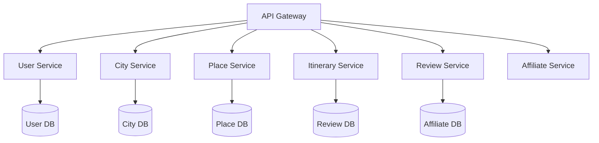

# Scalability

## Overview

The Scalability feature ensures that City Explorer can efficiently handle growing user demands, increasing data volumes, and expanding feature sets without compromising performance or user experience. This comprehensive scalability approach encompasses both horizontal and vertical scaling strategies, enabling the platform to accommodate everything from startup loads to enterprise-scale usage.

## Scaling Strategies

### Horizontal Scaling
- **Stateless Application Servers**: Enable adding/removing instances dynamically
- **Load Balancing**: Distribute traffic across multiple servers
- **Database Sharding**: Partition data across multiple database instances
- **Microservices Architecture**: Decompose monolith into scalable services
- **Container Orchestration**: Kubernetes for automated scaling

### Vertical Scaling
- **Instance Upgrades**: Increase CPU, memory, and storage resources
- **Database Scaling**: Upgrade to more powerful database instances
- **Caching Layer Expansion**: Increase Redis/Memcached capacity
- **Storage Scaling**: Expand file system and database storage
- **Network Bandwidth**: Increase throughput capabilities

## Architecture for Scalability

### Stateless Design
```javascript
// Example of stateless session management
class SessionManager {
  constructor(redisClient) {
    this.redis = redisClient;
  }
  
  async createSession(userId, userData) {
    const sessionId = uuid.v4();
    const sessionData = {
      userId,
      ...userData,
      createdAt: new Date(),
      expiresAt: new Date(Date.now() + 24 * 60 * 60 * 1000) // 24 hours
    };
    
    await this.redis.setex(
      `session:${sessionId}`, 
      24 * 60 * 60, // TTL in seconds
      JSON.stringify(sessionData)
    );
    
    return sessionId;
  }
  
  async getSession(sessionId) {
    const sessionData = await this.redis.get(`session:${sessionId}`);
    return sessionData ? JSON.parse(sessionData) : null;
  }
}
```

### Microservices Decomposition


### Event-Driven Architecture
```javascript
class EventPublisher {
  constructor(messageQueue) {
    this.queue = messageQueue;
  }
  
  async publish(eventType, eventData) {
    const event = {
      id: uuid.v4(),
      type: eventType,
      data: eventData,
      timestamp: new Date(),
      source: 'city-explorer'
    };
    
    await this.queue.send('events', JSON.stringify(event));
  }
}

class EventConsumer {
  constructor(messageQueue, handlers) {
    this.queue = messageQueue;
    this.handlers = handlers;
  }
  
  async consume() {
    await this.queue.consume('events', async (message) => {
      const event = JSON.parse(message.content.toString());
      const handler = this.handlers[event.type];
      
      if (handler) {
        try {
          await handler(event.data);
          this.queue.ack(message);
        } catch (error) {
          console.error('Event processing failed:', error);
          this.queue.nack(message);
        }
      }
    });
  }
}
```

## Load Balancing

### Load Balancer Types
- **Hardware Load Balancers**: Physical appliances for high-performance routing
- **Software Load Balancers**: NGINX, HAProxy for flexible configuration
- **Cloud Load Balancers**: AWS ALB, Google Cloud Load Balancer
- **DNS Load Balancing**: Geographic and latency-based routing

### Load Balancing Algorithms
- **Round Robin**: Even distribution across servers
- **Weighted Round Robin**: Distribution based on server capacity
- **Least Connections**: Route to least busy servers
- **IP Hash**: Session persistence for stateful applications
- **Least Response Time**: Route to fastest responding servers

### Health Checks
- **HTTP Health Checks**: Application endpoint verification
- **TCP Health Checks**: Port and connectivity validation
- **Script-based Checks**: Custom health assessment logic
- **Active/Passive Failover**: Automatic recovery from failures

## Database Scaling

### Read Replicas
- **Master-Slave Replication**: Distribute read load across replicas
- **Connection Pooling**: Efficient database connection management
- **Query Routing**: Direct reads to replicas, writes to master
- **Replica Lag Monitoring**: Track synchronization delays

#### Read Replica Implementation
```javascript
class DatabaseRouter {
  constructor(masterConfig, replicaConfigs) {
    this.master = new MongoClient(masterConfig.url);
    this.replicas = replicaConfigs.map(config => 
      new MongoClient(config.url)
    );
    this.currentReplica = 0;
  }
  
  async connect() {
    await this.master.connect();
    await Promise.all(this.replicas.map(replica => replica.connect()));
  }
  
  getReadConnection() {
    const replica = this.replicas[this.currentReplica];
    this.currentReplica = (this.currentReplica + 1) % this.replicas.length;
    return replica;
  }
  
  getWriteConnection() {
    return this.master;
  }
}
```

### Database Sharding
- **Horizontal Partitioning**: Split data across multiple databases
- **Shard Keys**: Deterministic data distribution strategy
- **Shard Routing**: Efficient query routing to correct shards
- **Rebalancing**: Automatic data redistribution as shards grow

### Caching Strategy
- **Multi-level Caching**: Application, CDN, and database caching
- **Cache Invalidation**: Consistent cache update strategies
- **Cache Warming**: Proactive cache population
- **Distributed Caching**: Redis Cluster for high availability

## Auto-scaling Implementation

### Kubernetes Autoscaling
```yaml
apiVersion: autoscaling/v2
kind: HorizontalPodAutoscaler
metadata:
  name: city-explorer-api
spec:
  scaleTargetRef:
    apiVersion: apps/v1
    kind: Deployment
    name: city-explorer-api
  minReplicas: 3
  maxReplicas: 20
  metrics:
  - type: Resource
    resource:
      name: cpu
      target:
        type: Utilization
        averageUtilization: 70
  - type: Resource
    resource:
      name: memory
      target:
        type: Utilization
        averageUtilization: 80
```

### Cloud Auto-scaling
- **AWS Auto Scaling**: EC2 instance scaling groups
- **Google Cloud Autoscaler**: Managed instance groups
- **Azure Virtual Machine Scale Sets**: Automated VM scaling
- **Serverless Scaling**: Function-as-a-Service auto-scaling

### Custom Metrics Scaling
- **Request Rate**: Scale based on incoming traffic
- **Queue Length**: Scale based on backlog size
- **Response Time**: Scale based on performance metrics
- **Business Metrics**: Scale based on user activity

## Performance Optimization

### Asynchronous Processing
- **Message Queues**: RabbitMQ, Apache Kafka for task distribution
- **Background Jobs**: Offload heavy processing from request threads
- **Task Prioritization**: Critical vs non-critical task handling
- **Retry Logic**: Handle transient failures gracefully

#### Background Job Processor
```javascript
class JobProcessor {
  constructor(queue, workerPool) {
    this.queue = queue;
    this.workers = workerPool;
  }
  
  async processJobs() {
    while (true) {
      const job = await this.queue.getNextJob();
      if (job) {
        const worker = this.workers.getAvailableWorker();
        if (worker) {
          worker.process(job)
            .then(result => {
              this.queue.completeJob(job.id, result);
            })
            .catch(error => {
              this.queue.failJob(job.id, error);
            });
        } else {
          // No workers available, put job back in queue
          await this.queue.requeueJob(job);
          await sleep(1000); // Wait before retrying
        }
      }
    }
  }
}
```

### Database Connection Pooling
```javascript
const { Pool } = require('pg');

const pool = new Pool({
  host: process.env.DB_HOST,
  port: process.env.DB_PORT,
  database: process.env.DB_NAME,
  user: process.env.DB_USER,
  password: process.env.DB_PASSWORD,
  max: 20, // Maximum number of clients in the pool
  min: 5,  // Minimum number of clients in the pool
  idleTimeoutMillis: 30000, // Close idle clients after 30 seconds
  connectionTimeoutMillis: 2000, // Return an error after 2 seconds if connection could not be established
});
```

### Content Delivery Network (CDN)
- **Static Asset Distribution**: Images, CSS, JavaScript files
- **Dynamic Content Caching**: API responses and rendered pages
- **Edge Computing**: Processing at CDN edge locations
- **Global Points of Presence**: Worldwide server distribution

## Monitoring and Metrics

### Scalability Metrics
- **System Load**: CPU, memory, disk, and network utilization
- **Request Latency**: Response time percentiles (p50, p95, p99)
- **Error Rates**: HTTP error codes and application exceptions
- **Throughput**: Requests per second and concurrent users
- **Resource Utilization**: Database connections, cache hit ratios

### Auto-scaling Triggers
- **CPU Utilization Thresholds**: Scale based on processor load
- **Memory Usage Limits**: Scale when memory pressure increases
- **Queue Backlog**: Scale based on pending work items
- **Response Time Degradation**: Scale when performance drops

### Capacity Planning
- **Historical Analysis**: Usage patterns and growth trends
- **Predictive Modeling**: Forecast future resource needs
- **Seasonal Adjustments**: Account for periodic traffic spikes
- **Buffer Planning**: Maintain excess capacity for unexpected loads

## Infrastructure as Code (IaC)

### Infrastructure Definition
```hcl
# Terraform example for scalable infrastructure
resource "aws_autoscaling_group" "city_explorer" {
  launch_configuration = aws_launch_configuration.city_explorer.name
  min_size             = 2
  max_size             = 20
  desired_capacity     = 3
  
  vpc_zone_identifier = [
    aws_subnet.private_a.id,
    aws_subnet.private_b.id
  ]
  
  tag {
    key                 = "Name"
    value               = "city-explorer-instance"
    propagate_at_launch = true
  }
}

resource "aws_launch_configuration" "city_explorer" {
  image_id        = "ami-0abcdef1234567890"
  instance_type   = "t3.medium"
  security_groups = [aws_security_group.city_explorer.id]
  
  user_data = <<-EOF
              #!/bin/bash
              docker run -d -p 3000:3000 cityexplorer/api:latest
              EOF
}
```

### Configuration Management
- **Infrastructure Templates**: Reusable deployment blueprints
- **Environment Variables**: Configuration through environment
- **Service Discovery**: Automatic service location
- **Rolling Updates**: Zero-downtime deployment strategies

## Disaster Recovery

### High Availability
- **Multi-zone Deployment**: Distribute across availability zones
- **Multi-region Setup**: Geographic redundancy
- **Automatic Failover**: Seamless transition during outages
- **Data Replication**: Real-time data synchronization

### Backup Strategies
- **Automated Backups**: Regular database and file backups
- **Point-in-Time Recovery**: Restore to specific moments
- **Cross-region Replication**: Geographically distributed backups
- **Backup Validation**: Regular restore testing

### Business Continuity
- **Recovery Time Objective (RTO)**: Maximum acceptable downtime
- **Recovery Point Objective (RPO)**: Maximum acceptable data loss
- **Disaster Recovery Plan**: Documented recovery procedures
- **Regular Drills**: Practice recovery scenarios

## Containerization and Orchestration

### Docker Implementation
```dockerfile
FROM node:16-alpine

WORKDIR /app

COPY package*.json ./
RUN npm ci --only=production

COPY . .

EXPOSE 3000

USER node

CMD ["npm", "start"]
```

### Kubernetes Deployment
```yaml
apiVersion: apps/v1
kind: Deployment
metadata:
  name: city-explorer-api
spec:
  replicas: 3
  selector:
    matchLabels:
      app: city-explorer-api
  template:
    metadata:
      labels:
        app: city-explorer-api
    spec:
      containers:
      - name: api
        image: cityexplorer/api:latest
        ports:
        - containerPort: 3000
        envFrom:
        - configMapRef:
            name: city-explorer-config
        resources:
          requests:
            memory: "256Mi"
            cpu: "250m"
          limits:
            memory: "512Mi"
            cpu: "500m"
        readinessProbe:
          httpGet:
            path: /health
            port: 3000
          initialDelaySeconds: 30
          periodSeconds: 10
```

## Service Mesh

### Traffic Management
- **Service Discovery**: Automatic service location
- **Load Balancing**: Intelligent traffic distribution
- **Fault Injection**: Test resilience under failure conditions
- **Traffic Shifting**: Gradual rollout of new versions

### Security Features
- **mTLS**: Mutual TLS encryption between services
- **Authorization**: Fine-grained access control
- **Certificate Management**: Automated certificate rotation
- **Audit Logging**: Comprehensive security event tracking

## Performance Testing

### Load Testing Scenarios
- **Baseline Testing**: Measure current performance
- **Stress Testing**: Determine breaking points
- **Soak Testing**: Long-term stability validation
- **Spike Testing**: Handle sudden traffic increases

### Scalability Testing
- **Horizontal Scaling Tests**: Validate instance addition
- **Vertical Scaling Tests**: Verify resource upgrades
- **Database Scaling Tests**: Confirm data layer scalability
- **Network Scaling Tests**: Validate bandwidth increases

## Monitoring and Alerting

### Scalability Monitoring
- **Auto-scaling Events**: Track scaling trigger activations
- **Resource Exhaustion**: Monitor approaching limits
- **Performance Degradation**: Detect slowing response times
- **Error Rate Increases**: Identify system stress

### Alerting Strategies
- **Threshold-based Alerts**: Notify when metrics exceed limits
- **Anomaly Detection**: Identify unusual patterns
- **Predictive Alerts**: Warn of anticipated issues
- **Escalation Policies**: Route alerts to appropriate teams

## Troubleshooting

### Common Scaling Issues

1. **Scaling Delays**
   - Solution: Optimize auto-scaling policies
   - Solution: Pre-warm instances
   - Solution: Reduce container startup time

2. **Resource Contention**
   - Solution: Implement proper resource limits
   - Solution: Optimize database queries
   - Solution: Add caching layers

3. **Network Bottlenecks**
   - Solution: Increase bandwidth allocation
   - Solution: Implement CDN
   - Solution: Optimize data transfer

## Future Enhancements

### Advanced Scaling Technologies
- **Serverless Architecture**: Function-based scaling
- **Edge Computing**: Processing closer to users
- **AI-powered Scaling**: Predictive resource allocation
- **Quantum Computing**: Future computational scaling

### Emerging Patterns
- **Chaos Engineering**: Proactive failure testing
- **GitOps**: Declarative infrastructure management
- **Progressive Delivery**: Gradual feature rollout
- **Observability**: Comprehensive system insight

## Best Practices

### For Developers
- Design stateless applications from the start
- Implement efficient caching strategies
- Optimize database queries and indexes
- Use asynchronous processing for heavy tasks
- Monitor performance metrics continuously

### For DevOps Teams
- Implement infrastructure as code
- Establish comprehensive monitoring
- Conduct regular performance testing
- Plan for capacity and growth
- Document scaling procedures

### For Architects
- Design for failure scenarios
- Plan multi-layered scaling approaches
- Consider cost implications of scaling
- Balance performance with resource usage
- Stay current with scaling technologies