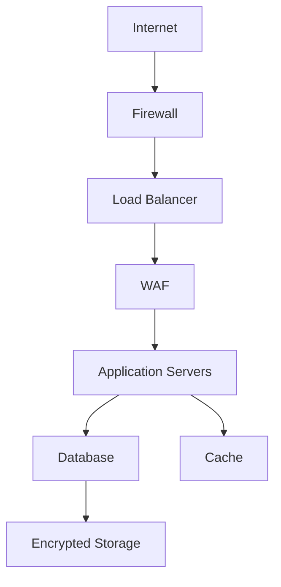

# Security

## Overview

The Security feature implements comprehensive protection measures to safeguard user data, prevent unauthorized access, and maintain the integrity of the City Explorer platform. This multi-layered security approach protects against various threat vectors while ensuring compliance with industry standards and regulations.

## Authentication System

### User Authentication
- **Password-based Login**: Traditional username/password authentication
- **OAuth Integration**: Social login through Google, Facebook, Apple
- **Multi-factor Authentication (MFA)**: Optional second-factor verification
- **Passwordless Authentication**: Magic link and biometric options

### Session Management
- **JWT Tokens**: Secure stateless authentication
- **Refresh Tokens**: Automatic token renewal
- **Session Timeout**: Automatic logout after inactivity
- **Concurrent Session Limits**: Prevent multiple simultaneous logins

#### Token Implementation
```javascript
class AuthManager {
  generateTokens(user) {
    const accessToken = jwt.sign(
      { userId: user._id, role: user.role },
      process.env.JWT_SECRET,
      { expiresIn: '15m' }
    );
    
    const refreshToken = jwt.sign(
      { userId: user._id, tokenType: 'refresh' },
      process.env.REFRESH_SECRET,
      { expiresIn: '7d' }
    );
    
    return { accessToken, refreshToken };
  }
  
  verifyToken(token) {
    try {
      return jwt.verify(token, process.env.JWT_SECRET);
    } catch (error) {
      throw new Error('Invalid token');
    }
  }
}
```

## Authorization Framework

### Role-Based Access Control (RBAC)
- **User Roles**: Standard user, premium user, admin, super admin
- **Permission Scopes**: Fine-grained access control
- **Resource Ownership**: User-specific data access
- **Administrative Privileges**: Elevated permissions for staff

### Access Control Lists (ACL)
- **API Endpoint Permissions**: Route-level access restrictions
- **Data Field Restrictions**: Selective data exposure
- **Action-based Permissions**: CRUD operation controls
- **Time-based Access**: Scheduled access restrictions

## Data Protection

### Encryption
- **Data-at-Rest Encryption**: AES-256 encryption for stored data
- **Data-in-Transit Encryption**: TLS 1.3 for all communications
- **Field-level Encryption**: Sensitive data encryption (PII, passwords)
- **Key Management**: Secure key rotation and storage

#### Encryption Implementation
```javascript
const crypto = require('crypto');

class EncryptionService {
  encrypt(data) {
    const iv = crypto.randomBytes(16);
    const cipher = crypto.createCipheriv(
      'aes-256-gcm', 
      Buffer.from(process.env.ENCRYPTION_KEY, 'hex'), 
      iv
    );
    
    let encrypted = cipher.update(data, 'utf8', 'hex');
    encrypted += cipher.final('hex');
    
    const authTag = cipher.getAuthTag();
    
    return {
      encryptedData: encrypted,
      iv: iv.toString('hex'),
      authTag: authTag.toString('hex')
    };
  }
  
  decrypt(encryptedObj) {
    const decipher = crypto.createDecipheriv(
      'aes-256-gcm',
      Buffer.from(process.env.ENCRYPTION_KEY, 'hex'),
      Buffer.from(encryptedObj.iv, 'hex')
    );
    
    decipher.setAuthTag(Buffer.from(encryptedObj.authTag, 'hex'));
    
    let decrypted = decipher.update(encryptedObj.encryptedData, 'hex', 'utf8');
    decrypted += decipher.final('utf8');
    
    return decrypted;
  }
}
```

### Data Masking
- **PII Protection**: Automatic masking of personal information
- **Log Sanitization**: Remove sensitive data from logs
- **Display Masking**: Partial obfuscation in UI
- **Export Controls**: Filter sensitive data in exports

## Input Validation and Sanitization

### Server-side Validation
- **Schema Validation**: Joi/Zod for request validation
- **Data Type Checking**: Strict type enforcement
- **Length and Range Limits**: Prevent buffer overflows
- **Format Validation**: Regex and pattern matching

#### Validation Example
```javascript
const Joi = require('joi');

const userSchema = Joi.object({
  username: Joi.string().alphanum().min(3).max(30).required(),
  email: Joi.string().email().required(),
  password: Joi.string().min(8).pattern(new RegExp('^(?=.*[a-z])(?=.*[A-Z])(?=.*[0-9])')).required(),
  firstName: Joi.string().max(50),
  lastName: Joi.string().max(50)
});

function validateUser(userData) {
  const { error, value } = userSchema.validate(userData);
  if (error) {
    throw new ValidationError(error.details[0].message);
  }
  return value;
}
```

### Client-side Sanitization
- **HTML Escaping**: Prevent XSS attacks
- **URL Encoding**: Safe parameter passing
- **JSON Sanitization**: Prevent injection attacks
- **File Upload Validation**: Type and size restrictions

## API Security

### Rate Limiting
- **Request Throttling**: Prevent abuse and DoS attacks
- **Adaptive Limits**: Dynamic rate adjustment
- **IP-based Restrictions**: Block malicious IPs
- **User-based Limits**: Account-specific restrictions

#### Rate Limiting Implementation
```javascript
const rateLimit = require('express-rate-limit');

const apiLimiter = rateLimit({
  windowMs: 15 * 60 * 1000, // 15 minutes
  max: 100, // limit each IP to 100 requests per windowMs
  message: 'Too many requests from this IP, please try again later.',
  standardHeaders: true,
  legacyHeaders: false,
});

app.use('/api/', apiLimiter);
```

### CORS Configuration
- **Origin Restrictions**: Whitelist allowed domains
- **Method Limiting**: Restrict HTTP methods
- **Header Controls**: Limit exposed headers
- **Credential Handling**: Secure cookie transmission

### API Key Management
- **Key Generation**: Secure random key creation
- **Key Rotation**: Regular key renewal
- **Access Scoping**: Limited permission keys
- **Usage Tracking**: Monitor key activity

## Network Security

### Firewall Configuration
- **Ingress Filtering**: Control incoming traffic
- **Egress Filtering**: Restrict outgoing connections
- **Port Restrictions**: Limit open ports
- **Geo-blocking**: Region-based access control

### DDoS Protection
- **Traffic Analysis**: Identify attack patterns
- **Rate Shaping**: Smooth traffic bursts
- **Blackhole Routing**: Drop malicious traffic
- **CDN Integration**: Distribute attack traffic

### Intrusion Detection
- **Signature-based Detection**: Known attack pattern matching
- **Anomaly Detection**: Unusual behavior identification
- **Log Analysis**: Security event correlation
- **Real-time Alerts**: Immediate threat notification

## Application Security

### Secure Coding Practices
- **Input Validation**: Never trust user input
- **Output Encoding**: Prevent injection attacks
- **Error Handling**: Generic error messages
- **Security Headers**: HTTP security response headers

#### Security Headers Implementation
```javascript
app.use((req, res, next) => {
  res.setHeader('X-Content-Type-Options', 'nosniff');
  res.setHeader('X-Frame-Options', 'DENY');
  res.setHeader('X-XSS-Protection', '1; mode=block');
  res.setHeader('Strict-Transport-Security', 'max-age=31536000; includeSubDomains');
  res.setHeader('Content-Security-Policy', "default-src 'self'");
  next();
});
```

### Dependency Security
- **Vulnerability Scanning**: Regular dependency checks
- **Patch Management**: Timely security updates
- **Supply Chain Security**: Verify package integrity
- **Version Pinning**: Prevent unexpected updates

## Privacy and Compliance

### GDPR Compliance
- **Data Minimization**: Collect only necessary information
- **User Rights**: Right to access, rectify, erase data
- **Consent Management**: Clear opt-in mechanisms
- **Data Portability**: Export user data in standard formats

### CCPA Compliance
- **Notice Requirements**: Inform users of data collection
- **Opt-out Rights**: Allow sale opt-out
- **Access Requests**: Provide user data upon request
- **Deletion Rights**: Honor data deletion requests

### HIPAA Compliance (if applicable)
- **Protected Health Information**: Secure handling of health data
- **Business Associate Agreements**: Partner compliance requirements
- **Audit Trails**: Comprehensive activity logging
- **Physical Security**: Secure data center access

## Incident Response

### Security Monitoring
- **Real-time Alerts**: Immediate threat detection
- **Behavioral Analysis**: Anomaly detection
- **Log Aggregation**: Centralized security event collection
- **Threat Intelligence**: External threat data integration

### Incident Response Plan
1. **Detection**: Identify security incidents
2. **Analysis**: Assess impact and scope
3. **Containment**: Limit incident spread
4. **Eradication**: Remove threat causes
5. **Recovery**: Restore normal operations
6. **Lessons Learned**: Improve future response

### Breach Notification
- **Internal Reporting**: Stakeholder communication
- **Regulatory Compliance**: Required authority notifications
- **User Notification**: Affected user communication
- **Public Relations**: Manage reputation impact

## Security Testing

### Penetration Testing
- **External Testing**: Third-party security assessments
- **Internal Audits**: Regular self-assessment
- **Vulnerability Scanning**: Automated security tools
- **Code Review**: Manual security analysis

### Security Scanning Tools
- **Static Analysis**: Source code security review
- **Dynamic Analysis**: Runtime vulnerability detection
- **Dependency Scanning**: Third-party library vulnerabilities
- **Configuration Auditing**: Infrastructure security checks

## User Education

### Security Awareness
- **Phishing Prevention**: Recognize social engineering
- **Password Security**: Strong password practices
- **Device Security**: Secure device usage
- **Public Wi-Fi Safety**: Safe network connections

### Best Practices Communication
- **Security Tips**: Regular user education
- **Policy Updates**: Clear communication of changes
- **Incident Reporting**: Easy reporting mechanisms
- **Feedback Loop**: User security suggestions

## Monitoring and Auditing

### Security Logs
- **Access Logs**: User authentication and authorization
- **Audit Trails**: Comprehensive activity recording
- **System Logs**: Infrastructure security events
- **Application Logs**: Business logic security events

### Compliance Reporting
- **Regulatory Reports**: Required compliance documentation
- **Internal Audits**: Regular security assessments
- **Third-party Audits**: Independent verification
- **Continuous Monitoring**: Ongoing compliance checks

## Security Architecture

### Defense in Depth


### Zero Trust Model
- **Never Trust, Always Verify**: Continuous authentication
- **Least Privilege**: Minimal necessary permissions
- **Microsegmentation**: Isolated security zones
- **Continuous Monitoring**: Persistent security validation

## Threat Modeling

### Common Threats
- **Injection Attacks**: SQL, NoSQL, command injection
- **Broken Authentication**: Session hijacking, credential theft
- **Sensitive Data Exposure**: Unencrypted data transmission
- **XML External Entities**: XXE attack vectors
- **Broken Access Control**: Privilege escalation
- **Security Misconfiguration**: Default settings exploitation
- **Cross-Site Scripting**: Client-side code injection
- **Insecure Deserialization**: Remote code execution
- **Using Components with Known Vulnerabilities**: Outdated dependencies
- **Insufficient Logging & Monitoring**: Undetected breaches

### Risk Assessment
- **Threat Identification**: Catalog potential attack vectors
- **Impact Analysis**: Evaluate business consequences
- **Likelihood Assessment**: Probability of occurrence
- **Mitigation Planning**: Prioritized security controls

## Security Operations

### Security Team Structure
- **Security Engineers**: Technical security implementation
- **Security Analysts**: Threat detection and response
- **Compliance Officers**: Regulatory adherence
- **Incident Responders**: Breach management

### Security Tools
- **SIEM**: Security information and event management
- **IDS/IPS**: Intrusion detection and prevention
- **DLP**: Data loss prevention
- **SOAR**: Security orchestration and response

## Troubleshooting

### Common Security Issues

1. **Authentication Failures**
   - Solution: Check credential validity
   - Solution: Verify token expiration
   - Solution: Review account status

2. **Authorization Errors**
   - Solution: Validate user permissions
   - Solution: Check role assignments
   - Solution: Review access control policies

3. **Data Breach Indicators**
   - Solution: Investigate unusual access patterns
   - Solution: Review security logs
   - Solution: Conduct forensic analysis

## Future Enhancements

### Advanced Security Features
- **Behavioral Biometrics**: User behavior authentication
- **AI-powered Threat Detection**: Machine learning security
- **Blockchain Security**: Immutable audit trails
- **Quantum-resistant Cryptography**: Future-proof encryption

### Emerging Technologies
- **Zero-Knowledge Proofs**: Privacy-preserving authentication
- **Homomorphic Encryption**: Computation on encrypted data
- **Decentralized Identity**: Self-sovereign identity management
- **Confidential Computing**: Hardware-level data protection

## Best Practices

### For Developers
- Follow secure coding guidelines
- Conduct regular security training
- Implement comprehensive input validation
- Use established security libraries
- Keep dependencies up to date
- Perform security code reviews

### For Security Teams
- Maintain current threat intelligence
- Conduct regular penetration testing
- Monitor security metrics and KPIs
- Stay informed about emerging threats
- Develop incident response procedures
- Coordinate with development teams

### For Management
- Allocate adequate security resources
- Establish clear security policies
- Support ongoing security education
- Ensure compliance with regulations
- Plan for security incident response
- Invest in security infrastructure